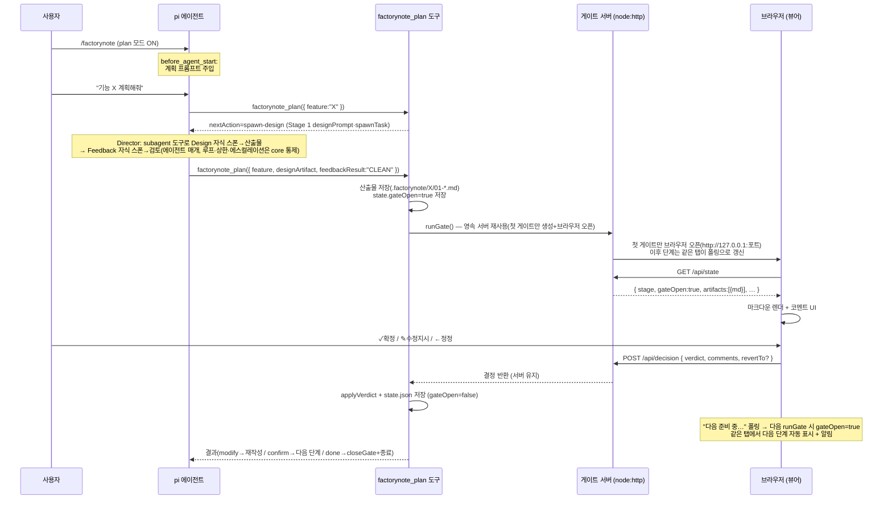

# 구현 아키텍처 — MVP 코드 구조와 런타임 흐름

FactoryNote MVP의 **실제 코드 구조·모듈 책임·런타임 데이터 흐름**을 기술한다.
기획/설계 배경은 [[multi-agent-pipeline]] · [[03-design/workflow-core/01-requirements|요구사항]], 구현 결정은 [[ADR-005-mvp-implementation]] 을 본다.

> **TL;DR**: FactoryNote MVP의 실제 코드 구조·모듈 책임·런타임 데이터 흐름·데이터 계약. Engine(중립 코어)·Adapter(Pi)·Viewer(정적)·CLI 4계층이며, 로컬 웹 페이지가 게이트다. 구현을 이해해야 하면 이 문서에서 시작한다.

> 한 줄: `/factorynote` 로 plan 모드를 켜면, 에이전트가 `factorynote_plan` 도구로 스테이지를 구성(동적)하고 단계별 산출물을 작성·제출하며, **로컬 웹 페이지가 게이트**가 되어 사용자 결정을 받아 단계를 전이한다.

## 3계층 코드 맵

이식성 경계(Layer 1-2 = harness 중립, Layer 3 = Pi 접촉)는 [[ADR-004-monorepo-structure]] 를 그대로 따른다. MVP는 모든 계층이 실구현되었다.

| 계층 | 위치 | 핵심 파일 | 책임 |
| ---- | ---- | ---- | ---- |
| **Engine** (중립) | `packages/factorynote/src/` | `types.ts` · `stages.ts` · `engine.ts` · `persistence.ts` | 스테이지 카탈로그·동적 구성 정의·순수 상태기계·영속(atomic r/w). `node:*` 만 사용(런타임 npm 의존 0). |
| **Adapter** (Pi) | `apps/pi-extension/src/` | `index.ts` · `plan-tool.ts` · `gate-server.ts` | `/factorynote` 명령·plan 모드 프롬프트 주입·`factorynote_plan` 도구·게이트 HTTP 서버. Pi 에이전트와 코어를 연결. |
| **Viewer** (정적) | `apps/plan-viewer/` | `src/App.jsx` · `components/{PlanPage,GateBar}.jsx` · `lib/mdToBlocks.js` | 브라우저에서 산출물 렌더 + 코멘트 + 게이트 버튼. `/api/state` fetch → `/api/decision` POST. |
| **CLI** (중립) | `bin/factorynote.mjs` | — | 순수 Node 상태 조회(`status`). Tier 0 진입점(ADR-003). |

## 모듈 상세

### Engine — `packages/factorynote/src/` (harness-agnostic)

판정·실행의 **제어흐름과 신뢰성**만 담당한다. 산출물 *내용* 판단은 에이전트(LLM)가 한다(하이브리드 원칙, [[01-requirements|NFR-4]]).

- **`stages.ts`** — M1 Stage Catalog. `STAGE_CATALOG` 6종(`StageKindDefinition`: kind·이름·산출물·포맷·`designPrompt`·`fileSuffix`·`graph` — none/optional/required 로 단계별 그래프 의무 분기, ADR-019) + 구성 인스턴스화 `stageDefs`·`stageDefAt`(위치 id·산출물 파일명 `<NN>-<kind>.md` 부여, [[ADR-031-dynamic-stage-composition]]). 모든 종류가 산출물을 생성한다. Feedback 검토 축은 여기 없음 — 전역 `FEEDBACK_AGENTS` 레지스트리([[ADR-014-dynamic-feedback-agents]]), 새 종류는 `feedbackProfileOf` 로 기존 1|2|3 프로필에 사상.
- **`engine.ts`** — 순수 상태기계. `initialState(feature, stages)` · `markArtifactReady` · `applyVerdict(state, decision)`(confirm→다음 단계/마지막 단계에서 완료, modify→loopCount++·`atLoopCeiling` 경성 에스컬레이션, revert→`revertTo`(생략 시 1단계, clamp `1..현단계-1`) 점프 + `validThrough` 갱신) · `MAX_LOOPS`/`atLoopCeiling`(FR-2). 단계 전이는 `state.stages` 구성 길이 기준. 부작용 없는 함수 — `engine.test.ts` 로 LLM/pi 없이 검증.
- **`persistence.ts`** — M3. `.factorynote/<feature>/state.json` atomic 쓰기(write-then-rename), 손상 시 `.corrupt-<ts>` 백업 후 `undefined` 복구(NFR-2). `stages` 누락 구 state 는 레거시 3종 구성으로 마이그레이션(미등록 종류는 손상 복구, [[ADR-031-dynamic-stage-composition]]). 산출물 r/w — 단계 산출물(`<NN>-<kind>.md` 규약 파일)은 `<feature>/stageN/` 서브폴더(위치 N 을 파일명에서 추론), 보조 파일(draft·design-prompt·feedback-menu)은 feature 루트([[ADR-015-stage-artifact-folders]]). 경로를 인자로 받아 pi 의존 0.
- **`types/`** — 타입 디렉터리(`gate.ts`·`pipeline.ts`·`feedback.ts`·`graph.ts` + `index.ts` 배럴). `StageId`·`GateVerdict`·`GateDecision`·`PipelineState` 와 오케스트레이션 계약(`SpawnOptions`·`DesignFeedbackDirective`·`ArtifactPaths`)·그래프 프로토콜 타입. `FeedbackAgent`·`FeedbackCapability` 는 `feedback.ts` 에 — 레지스트리(feedback-agents.ts)와 데이터 파일 간 순환 import 방지(2026-08 하드닝).

> 코어는 `@factorynote/core` 로 import된다. 런타임 npm 의존이 0이라 **복사만으로 다른 harness에 이식** 가능하다(NFR-1).

### Adapter — `apps/pi-extension/src/` (Pi 전용)

Pi 와 코어를 잇는 유일한 계층. pi가 jiti로 TS 를 직접 로드한다.

- **`index.ts`** — 확장 진입(기본 내보내기 팩토리).
  - `pi.registerCommand("factorynote", …)` — **설정 대시보드**(세션 상태 소유: `planMode`·`autoAdvance`·`feedbackLevel`·`designLevel`·`stageCap`). 인자 없는 명령이 설정 메뉴를 연다 — feedback·design·stage·auto 4개 설정 항목과 plan 모드 on/off([[ADR-032-settings-dashboard-menu]]). 서브커맨드 없음.
  - `pi.on("before_agent_start", …)` — `planMode` 가 ON 일 때 매 턴 **계획 전용 시스템 프롬프트**를 주입("코드 금지, `factorynote_plan` 으로 구성→단계 구동").
  - `pi.registerTool("factorynote_plan", …)` — 파이프라인 구동 도구(아래).
  - `resolveViewerDistDir(cwd)` — 뷰어 dist 후보 탐색: `FACTORYNOTE_VIEWER_DIST` 환경변수 → `<extdir>/viewer/dist`(설치형) → `<cwd>/apps/plan-viewer/dist`(개발).
- **`plan-tool.ts`** — `drivePlan(input)`. 도구의 단일 구동 단위(Tier 1, [[ADR-009-tier-1-agent-orchestration]]):
  1. 상태 로드(손상 시 복구). 완료 시 종료 안내. **신규 피처 + 구성 미제출 → `nextAction=compose`(카탈로그 메뉴 요청) — `stages` 제출 시 구성 영속화로 파이프라인 시작, `maxStages` 상한 초과 구성은 잘라서 적용(디렉터 동적 구성, [[ADR-031-dynamic-stage-composition]]).**
  2. **인터럽트 복구**: 게이트 열린 채 재진입 시 디스크 산출물로 게이트 재오픈. 게이트 열림 중 `designArtifact` 재제출(채팅 수정)은 draft 반영 후 재오픈.
  3. 산출물 단계 진입 시 `design-prompt.md`·`feedback-menu.md` 기록(파일 프로토콜, ADR-010) 후 **Stage 2 그래프 강제**(`enforceRequiredGraph` — 미충족 시 재작성 반려/상한 소진 시 게이트 에스컬레이션, ADR-019).
  4. `nextDesignFeedbackStep`(`df-transition.ts`) 순수 전이로 Design↔Feedback 스폰 지시문 라우팅 → `spawnDirective` 가 Director 에이전트에게 자식 스폰 과제 반환(동기 스폰 불가 하네스 — 파일 경로 교환).
  5. 내부 사이클 수렴/에스컬레이션 → `runOpenGate`(`plan-gate.ts`) 게이트.
- **`gate-server.ts`** — 웹 게이트. **기능별 영속 서버**(`runGate(opts)`·`observeGate`). 채널별 분리 모듈: `gate-manager.ts`(서버 풀·채팅 상태) · `gate-http.ts`(/api/* 라우터 + 엔드포인트 핸들러·정적 SPA) · `viewer-state.ts`(/api/state 페이로드 조립) · `gate-browser.ts`(브라우저 오픈 — `spawn` 인자 배열·shell:false 로 주입 구조 차단) · `gate-events.ts`(이벤트 계약).
  - `GET /api/state` → `ViewerState` JSON. **`GET /api/events` → SSE push**(폴링 대체, [[ADR-022-viewer-sse-push]]) — 산출물 기록·채팅 변동 시에만 push, SSE 연결 자체가 탭 하트비트(재오픈 판정 흡수).
  - `POST /api/decision`(결정) · `POST /api/review-request`(+1 재검토 사이클, 게이트 유지) · `GET/POST /api/chat`·`POST /api/chat/cancel`(채팅 큐 — read-wins 취소, [[ADR-024-chat-send-queue]]·[[ADR-026-stage-request-queue-transit]]).
  - 브라우저 자동 오픈은 탭이 없을 때만(SSE 클라이언트 없음 + 하트비트 경과). `closeGate(root, feature)` 로 플랜 완료 시에만 종료.

### Viewer — `apps/plan-viewer/` (React + Vite)

빌드 산출물 `dist/` 가 게이트 서버를 통해 서빙된다.

- **`App.jsx`** — **SSE push 수신 상태머신**(loading/reviewing/preparing/closed, [[ADR-022-viewer-sse-push]]). 단일 `EventSource` 로 `state`·`chat` 이벤트 수신 — 폴링 없음. 확정·검토 요청 중에도 기존 페이지 유지 + 게이트 바 로딩 연출, 게이트 재오픈 시 같은 탭에서 다음 단계로 교체(알림). 헤더 스텝퍼로 **이전 단계 읽기 전용 보기** 전환 가능([[ADR-023-viewer-transition-ux]]).
- **`PlanPage.jsx`** — 마크다운 단계(1/2/3 공통). 마크다운 → 블록(`mdToBlocks`) 렌더 + 블록/셀/드래그 영역 코멘트 + pending 큐([[core-features]] 사양). 게이트 버튼 → `onGate({verdict, comments})`. 그래프는 md 의 `<!-- graph: <파일명> -->` 참조 블록으로 렌더(아래 `GraphView`).
- **`GraphView.jsx`** — 읽기 전용 계층 드릴다운 그래프(react-flow). `/api/state` 의 `artifacts[].graphs[]`(산출물당 다중·에이전트 자유 네이밍, [[ADR-020-multi-named-graphs]]) 참조 위치에 인라인 렌더 — 종류는 envelope `type` 으로 분기: 계층 트리(드릴다운, [[ADR-018-hierarchical-graph-tree]]) · sequence · flowchart([[ADR-021-sequence-flowchart-graphs]]). 배치는 뷰어 자동 배치(좌표 필드 금지) — 드래그·연결·편집 없음, 수정은 채팅으로.
- **`GateBar.jsx`** — 하단 게이트 바: **✓ 확정**(confirm) / **✎ 수정 지시**(modify, pending 코멘트 전송) / **← 정정**(revert).

## 런타임 데이터 흐름



> 핵심: 게이트 결정은 **에이전트 기억이 아닌 `state.json` 이 권위**(NFR-2). 세션을 넘어 resume 되어도 단계가 보존된다.

## 데이터 계약 (Contracts)

### `state.json` — `PipelineState` (`.factorynote/<feature>/state.json`)

```json
{
  "feature": "user-auth",
  "stage": 3,
  "gateOpen": false,
  "loopCount": 0,
  "validThrough": 2,
  "done": false,
  "history": [
    { "stage": 1, "verdict": "confirm", "at": 1722500000000 },
    { "stage": 2, "verdict": "modify",  "at": 1722500100000 }
  ],
  "createdAt": 1722500000000,
  "updatedAt": 1722505600000
}
```

### `GET /api/state` → `ViewerState`

```json
{
  "feature": "user-auth",
  "stage": 2,
  "stageName": "모듈 · 클래스 설계",
  "requiresArtifact": true,
  "done": false,
  "designPrompt": "…",
  "feedbackChecklist": ["…"],
  "artifacts": [
    { "stage": 1, "name": "요청 이해 · 동작 시나리오", "file": "01-understanding-and-scenarios.md", "format": "markdown", "md": "# 요구사항·시나리오\n…" },
    { "stage": 2, "name": "모듈 · 클래스 설계", "file": "02-design.md", "format": "markdown",
      "md": "# 설계\n\n<!-- graph: module-deps.json -->\n\n…",
      "graphs": [ { "file": "module-deps.json", "type": "tree", "data": { "file": "module-deps.json", "childLevel": "modules", "nodes": [ { "id": "frontend", "children": { "file": "modules/frontend.json", "parentId": "frontend", "nodes": […] } }, … ] } }, { "file": "login-seq.json", "type": "sequence", "data": { "version": 2, "type": "sequence", "participants": […], "body": […] } } ] }
  ]
}
```

### `POST /api/decision` ← `GateDecision`

```json
{ "verdict": "modify", "comments": [ { "blockId": "b3", "quote": "일부 텍스트", "text": "더 구체적으로" } ] }
```

- `verdict`: `confirm`(다음 단계) · `modify`(현 단계 재작성, 코멘트 전달) · `revert`(회귀 — `revertTo` 생략 시 1단계, 지정 시 해당 단계 점프, 엔진이 `1..현단계-1` 로 clamp).
- `comments`: 블록(`blockId`) / 드래그 영역(`quote`) / 셀 공통. modify 일 때만 의미. (그래프 직접 편집·`artifactMd` 역동기화는 폐지 — 수정은 채팅으로, [[ADR-016-graph-json-externalization]])
- `revertTo?`: FR-7. 뷰어 회귀대상 Stage 셀렉터가 전송(1..3). gate-server 가 forward(과거 drop P0 수정됨) → 엔진 clamp + `invalidateArtifactsAfter(state.stage)` 로 대상 이후 산출물 무효화.

### `factorynote_plan` 도구 — `drivePlan` 입출력

- **입력**: `{ feature: string }` (도구 파라미터) + `designArtifact`·`feedbackResult`·`chatResponse`(경로/판정/답변). 내부적으로 `root`·`viewerDistDir`·`signal` 추가.
- **출력(에이전트로)**: `{ done, stage, stageName, needArtifact, designPrompt, feedbackChecklist, gateResult, message }`. `message` 가 다음 행동을 직접 지시(modify→재작성, confirm→다음 산출물 작성, done→종료).

### 그래프 산출물(Stage 2·선택 Stage 3) — md + 종류별 그래프 파일

그래프 데이터는 산출물 md 옆 파일([[ADR-018-hierarchical-graph-tree]])로 저장하고, md 는 `<!-- graph: <파일명> -->` 참조 코멘트를 가진다([[ADR-016-graph-json-externalization]] 승계). 산출물당 그래프 여러 개·에이전트 자유 네이밍([[ADR-020-multi-named-graphs]]), 종류 3종 — 파일 envelope 의 `type` 필드로 판별, type 없음 = 계층 트리([[ADR-021-sequence-flowchart-graphs]]):

**계층 트리**(루트 + 자식 파일 서브디렉터리):

```
stage2/module-deps.json                # 루트 — 최상위(모듈) 레벨, 이름은 에이전트 결정
stage2/module-deps/modules/ui.json     # 모듈 ui 의 자식(클래스) 레벨
stage2/module-deps/modules/ui/View.json  # 클래스 View 의 자식(메서드) 레벨
```

```json
{
  "version": 2, "id": "ui", "childLevel": "classes",
  "nodes": [
    { "id": "View", "type": "class", "name": "View",
      "refs": [{ "to": "AuthService", "comment": "인증 요청" }],
      "children": "modules/ui/View.json" }
  ]
}
```

- 레벨 파일 공통 envelope: `{version:2, id?, title?, childLevel?, nodes}`. 노드는 `{id, ...표시 필드, refs?, children?}` — `children` 은 루트 디렉터리 기준 상대경로.
- 관계는 `refs: [{to, comment}]` **나가는 방향만 소스 노드 파일에** 작성. 단방향 한쪽·양방향 양쪽, comment 필수. 별도 edges 배열 없음.
- **`position`·`width`·`height` 금지** — 좌표는 뷰어 자동 배치가 유일한 출처(3종 공통).

**Sequence**(단일 파일, ADR-021): `{version:2, type:"sequence", id?, title?, participants:[{id, name?, ...}], body:[...]}` — body 는 메시지 `{from, to, label, kind?:"call"|"reply"}` 와 fragment `{kind:"alt"|"loop"|"opt", label?, body:[중첩]}` 의 순서 목록(임의 깊이). 뷰어 `SequenceView` SVG: 참여자 컬럼·라이프라인·시간축 화살표(reply 점선)·fragment 구간 박스.

**Flowchart**(단일 파일, ADR-021): `{version:2, type:"flowchart", id?, title?, nodes:[{id, label, shape?:"terminal"|"process"|"decision"}], edges:[{from, to, label?}]}`. 뷰어 `FlowchartView` SVG: Kahn 랭크 + barycenter 자동 배치, shape 구분, 백엣지 점선.

- `core/graph.ts` 가 종류별 envelope 검증(`coerceGraphLevelFile`·`coerceGraphSequenceFile`·`coerceGraphFlowchartFile`·`parseAnyGraphKind`·경로 안전); 표시 필드는 불투명.
- 게이트 서버가 참조마다 종류를 판별해 서빙 — tree 는 도달 가능 파일 조립 `graphs[].data`, sequence·flowchart 는 단일 파일 파싱 그대로. 게이트 오픈 시 `promoteGraphTree` 가 각 참조 트리를 에이전트 이름 그대로 `stageN/` 에 승격(고아 제외, md 재작성 없음; 단일 파일 그래프는 루트 1개 복사). 회귀 시 md 참조를 읽어 동반 파일·디렉터리 무효화.

## 설치 레이아웃 — `~/.pi/agent/extensions/factorynote/`

`scripts/install.mjs` 가 아래 구조로 배치. pi 가 `~/.pi/agent/extensions/*/index.ts` 를 자동 발견한다.

```
factorynote/
├── index.ts · plan-tool.ts · gate-server.ts   # 확장(= apps/pi-extension/src/)
├── package.json                                 # { type: module }
├── node_modules/@factorynote/core/              # 코어(로컬 패키지 — @factorynote/core import 해석)
│   ├── src/{index,types,stages,engine,persistence}.ts
│   ├── protocol/ …
│   └── package.json                             # exports["."]="./src/index.ts"
└── viewer/dist/                                 # 빌드된 뷰어(= apps/plan-viewer/dist)
```

- pi(jiti)가 TS 를 직접 로드 → 컴파일 불필.
- `@factorynote/core` 는 로컬 `node_modules` 패키지로 복사되어 import 해석.
- `typebox` · `@earendil-works/pi-coding-agent` 는 pi 런타임이 제공(pi 자신의 node_modules).

## 핵심 결정 요약

| 주제 | 결정 | 근거 |
| ---- | ---- | ---- |
| plan 모드 진입 | `/factorynote` 토글 + 프롬프트 주입 | 사용자 시드(모드), FR-8(직접 시작) 아님 |
| 게이트 UI | **웹 페이지**(로컬 HTTP 서버) | ADR-003 은 옵션이나 시드가 명시 → 주경로 격상 |
| 산출물/상태 위치 | `.factorynote/<feature>/` 통합, 단계 산출물은 `stageN/` 서브폴더 | 시드 부합 + gitignore 1건; [[ADR-015-stage-artifact-folders]] |
| 에이전트 티어 | **Tier 1**(Design↔Feedback 자식 스폰 루프, 유일 경로) | [[ADR-009-tier-1-agent-orchestration]]; Tier 0·NFR-7 폐지 |
| 제어 vs 판단 | 제어·영속=코드, 산출물=LLM | 하이브리드 원칙(NFR-4) |
| 단계별 렌더 | 모든 단계가 동일 문서 경로(PlanPage), 스템퍼는 `/api/state.stages` 구성 기준 동적 렌더, 그래프는 읽기 전용 자동 배치 블록(GraphView) | [[ADR-016-graph-json-externalization]] · [[ADR-031-dynamic-stage-composition]] |
| 그래프 데이터 | md 옆 계층 트리 `.json`(루트 + 자식 파일 서브디렉터리) + `<!-- graph: -->` 참조, 나가는 refs {to,comment}, position 금지·자동 배치·드릴다운 | [[ADR-018-hierarchical-graph-tree]] · [[ADR-016-graph-json-externalization]] |
| 회귀(revert) | **다단계 점프**(`revertTo` + clamp `1..현단계-1`) + 대상 이후 산출물 무효화 | FR-7; 뷰어→gate-server→엔진 seam |
| 반복 상한 | modify@ceiling 시 **경성 에스컬레이션**(잔존 이슈 + 재작성/회귀/재협의 옵션) | FR-2(`MAX_LOOPS`/`atLoopCeiling`) |
| 게이트 만료 | `timeoutMs`(기본 30min) + `settled` 가드 → 좀비 게이트 자동 modify 복귀 | #4 신뢰성 |
| gateOpen resume | 인터럽트 시 게이트 재오픈(산출물 재작성 요구 안 함) | #3 |
| plan 모드 종료 | 파이프라인 done 시 `planMode=false` 자동 해제 | UX(수동 토글 부담 제거) |

전체 결정 배경은 [[ADR-005-mvp-implementation]].

## 참고

- [[multi-agent-pipeline]] — 파이프라인·에이전트 역할(기획)
- [[03-design/workflow-core/01-requirements|workflow-core 요구사항]] — FR/NFR
- [[ADR-003-viewer-architecture]] · [[ADR-005-mvp-implementation]] · [[ADR-004-monorepo-structure]]
- [[90-meta/usage-guide]] · [[90-meta/development-guide]]
- [[Home]]
