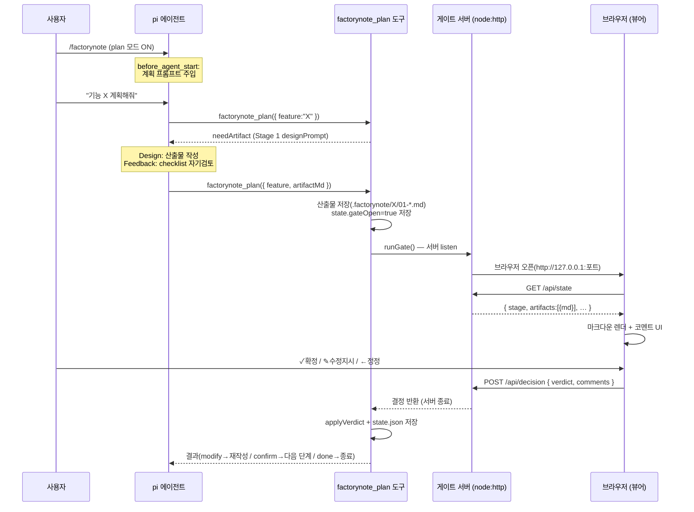

# 구현 아키텍처 — MVP 코드 구조와 런타임 흐름

FactoryNote MVP의 **실제 코드 구조·모듈 책임·런타임 데이터 흐름**을 기술한다.
기획/설계 배경은 [[multi-agent-pipeline]] · [[03-design/workflow-core/01-requirements|요구사항]], 구현 결정은 [[ADR-005-mvp-implementation]] 을 본다.

> 한 줄: `/factorynote` 로 plan 모드를 켜면, 에이전트가 `factorynote_plan` 도구로 6단계 산출물을 작성·제출하고, **로컬 웹 페이지가 게이트**가 되어 사용자 결정을 받아 단계를 전이한다.

## 3계층 코드 맵

이식성 경계(Layer 1-2 = harness 중립, Layer 3 = Pi 접촉)는 [[ADR-004-monorepo-structure]] 를 그대로 따른다. MVP는 모든 계층이 실구현되었다.

| 계층 | 위치 | 핵심 파일 | 책임 |
| ---- | ---- | ---- | ---- |
| **Engine** (중립) | `packages/factorynote/src/` | `types.ts` · `stages.ts` · `engine.ts` · `persistence.ts` | 6단계 정의·순수 상태기계·영속(atomic r/w). `node:*` 만 사용(런타임 npm 의존 0). |
| **Adapter** (Pi) | `apps/pi-extension/src/` | `index.ts` · `plan-tool.ts` · `gate-server.ts` | `/factorynote` 명령·plan 모드 프롬프트 주입·`factorynote_plan` 도구·게이트 HTTP 서버. Pi 에이전트와 코어를 연결. |
| **Viewer** (정적) | `prototypes/plan-page-mockup/` | `src/App.jsx` · `components/{PlanPage,GateBar}.jsx` · `lib/mdToBlocks.js` | 브라우저에서 산출물 렌더 + 코멘트 + 게이트 버튼. `/api/state` fetch → `/api/decision` POST. |
| **CLI** (중립) | `bin/factorynote.mjs` | — | 순수 Node 상태 조회(`status`). Tier 0 진입점(ADR-003). |

## 모듈 상세

### Engine — `packages/factorynote/src/` (harness-agnostic)

판정·실행의 **제어흐름과 신뢰성**만 담당한다. 산출물 *내용* 판단은 에이전트(LLM)가 한다(하이브리드 원칙, [[01-requirements|NFR-4]]).

- **`stages.ts`** — M1 Stage Registry. `STAGES` 배열(6개 `StageDefinition`: id·이름·산출물·포맷·`designPrompt`·`feedbackChecklist`·`artifactFile`). Stage 6는 `producesArtifact: false`(최종 검증, 산출물 없음).
- **`engine.ts`** — 순수 상태기계. `initialState` · `markArtifactReady` · `applyVerdict(state, decision)`(confirm→다음 단계/완료, modify→현 단계 재작성+loopCount++, revert→이전 단계) · `isComplete`. 부작용 없는 함수 — `engine.test.ts` 로 LLM/pi 없이 검증.
- **`persistence.ts`** — M3. `.factorynote/<feature>/state.json` atomic 쓰기(write-then-rename), 손상 시 `.corrupt-<ts>` 백업 후 `undefined` 복구(NFR-2). 산출물 `NN-stage.md` r/w. 경로를 인자로 받아 pi 의존 0.
- **`types.ts`** — `StageId`·`GateVerdict`(`confirm`/`modify`/`revert`)·`Comment`·`GateDecision`·`PipelineState`.

> 코어는 `@factorynote/core` 로 import된다. 런타임 npm 의존이 0이라 **복사만으로 다른 harness에 이식** 가능하다(NFR-1).

### Adapter — `apps/pi-extension/src/` (Pi 전용)

Pi 와 코어를 잇는 유일한 계층. pi가 jiti로 TS 를 직접 로드한다.

- **`index.ts`** — 확장 진입(기본 내보내기 팩토리).
  - `pi.registerCommand("factorynote", …)` — plan 모드 **토글**(세션 내 불리언 `planMode`). `/factorynote on|off` 로 명시 설정도 가능.
  - `pi.on("before_agent_start", …)` — `planMode` 가 ON 일 때 매 턴 **계획 전용 시스템 프롬프트**를 주입("코드 금지, `factorynote_plan` 으로 6단계 구동").
  - `pi.registerTool("factorynote_plan", …)` — 파이프라인 구동 도구(아래).
  - `resolveViewerDistDir(cwd)` — 뷰어 dist 후보 탐색: `FACTORYNOTE_VIEWER_DIST` 환경변수 → `<extdir>/viewer/dist`(설치형) → `<cwd>/prototypes/plan-page-mockup/dist`(개발).
- **`plan-tool.ts`** — `drivePlan(input)`. 도구의 단일 구동 단위:
  1. 상태 로드(없으면 `initialState`). 완료 시 완료 메시지.
  2. 현 단계가 산출물 단계인데 `artifactMd` 가 없으면 → 작성 지시(`designPrompt`+`feedbackChecklist`) 반환.
  3. `artifactMd` 제출 → 산출물 저장 → `markArtifactReady` → `runGate`(블로킹) → 결정 → `applyVerdict` → 저장.
  4. 결과로 에이전트에게 다음 행동 안내(modify=재작성, confirm=다음 단계, done=종료).
- **`gate-server.ts`** — 웹 게이트. `runGate(opts)`:
  - `node:http` 서버를 임의 포트(`127.0.0.1:0`)에 구동.
  - `GET /api/state` → `ViewerState` JSON(현 단계 + 산출물 마크다운 목록).
  - `GET /` · `GET /assets/*` → 뷰어 dist 정적 서빙(SPA fallback).
  - `POST /api/decision` → `{verdict, comments}` 수신 → 결정 Promise 해결 → 30ms flush 여유 후 서버 종료.
  - 브라우저 자동 오픈(Win=`start`, mac=`open`, linux=`xdg-open`). `signal` 중단 시 modify 로 복귀.

### Viewer — `prototypes/plan-page-mockup/` (React + Vite)

빌드 산출물 `dist/` 가 게이트 서버를 통해 서빙된다.

- **`App.jsx`** — `/api/state` fetch → Stage 3/4 는 `GraphStage`, 나머지는 `PlanPage` 로 분기 렌더. `/api/decision` POST 후 "전송 완료" 화면.
- **`PlanPage.jsx`** — 마크다운 단계(1/2/5/6). 마크다운 → 블록(`mdToBlocks`) 렌더 + 블록/셀/드래그 영역 코멘트 + pending 큐([[core-features]] 사양). 게이트 버튼 → `onGate({verdict, comments})`.
- **`GraphStage.jsx`** — 그래프 단계(3/4). 다중 섹션 인터랙티브 에디터(react-flow): `/api/state` 의 `graphSections` 로 데이터 주동 렌더 + 섹션 추가·이름·삭제 + 노드/엣지 CRUD(우클릭 메뉴) + 상세 패널 편집 + 클래스 parent-child·`NodeResizer` + 코멘트. 게이트 제출 시 편집된 그래프 전체(`graphSections`)를 `onGate` 로 전달(직접 편집 → 에이전트 채택, [[ADR-006-graph-editor]]).
- **`GateBar.jsx`** — 하단 게이트 바: **✓ 확정**(confirm) / **✎ 수정 지시**(modify, pending 코멘트 전송) / **← 정정**(revert). `PlanPage`·`GraphStage` 공용.

## 런타임 데이터 흐름



> 핵심: 게이트 결정은 **에이전트 기억이 아닌 `state.json` 이 권위**(NFR-2). 세션을 넘어 resume 되어도 단계가 보존된다.

## 데이터 계약 (Contracts)

### `state.json` — `PipelineState` (`.factorynote/<feature>/state.json`)

```json
{
  "feature": "user-auth",
  "stage": 3,
  "gateOpen": false,
  "loopCount": 0,
  "done": false,
  "history": [
    { "stage": 1, "verdict": "confirm", "at": 1722500000000 },
    { "stage": 2, "verdict": "modify",  "at": 1722500100000 }
  ],
  "createdAt": 1722500000000,
  "updatedAt": 1722505600000
}
```

### `GET /api/state` → `ViewerState`

```json
{
  "feature": "user-auth",
  "stage": 3,
  "stageName": "모듈 아키텍처 설계",
  "requiresArtifact": true,
  "done": false,
  "designPrompt": "…",
  "feedbackChecklist": ["…"],
  "artifacts": [
    { "stage": 1, "name": "요청 이해", "file": "01-requirements.md", "format": "markdown", "md": "# 요구사항\n…" },
    { "stage": 3, "name": "모듈 아키텍처 설계", "file": "03-modules.json", "format": "nodes-edges",
      "graphSections": [{ "id": "frontend", "title": "프론트엔드", "nodes": [{ "id": "UI", "data": { "label": "UI" } }], "edges": [] }] }
  ]
}
```

### `POST /api/decision` ← `GateDecision`

```json
{ "verdict": "modify", "comments": [ { "blockId": "b3", "quote": "일부 텍스트", "text": "더 구체적으로" } ],
  "graphSections": [ { "id": "frontend", "title": "프론트엔드", "nodes": […], "edges": […] } ] }
```

- `verdict`: `confirm`(다음 단계) · `modify`(현 단계 재작성, 코멘트 전달) · `revert`(이전 단계 회귀).
- `comments`: 블록(`blockId`) / 드래그 영역(`quote`) / 셀 공통. modify 일 때만 의미.
- `graphSections`: 그래프 단계(Stage 3/4)에서 사용자가 편집한 그래프 전체. `drivePlan` 이 이를 `.json` 산출물로 저장(직접 편집 → 에이전트 채택).

### `factorynote_plan` 도구 — `drivePlan` 입출력

- **입력**: `{ feature: string, artifactMd?: string }` (도구 파라미터). 내부적으로 `root`·`viewerDistDir`·`signal` 추가.
- **출력(에이전트로)**: `{ done, stage, stageName, needArtifact, designPrompt, feedbackChecklist, gateResult, message }`. `message` 가 다음 행동을 직접 지시(modify→재작성, confirm→다음 산출물 작성, done→종료).

### 그래프 산출물(Stage 3/4) — `.json`

그래프 단계(모듈·클래스) 산출물은 마크다운이 아닌 **다중 섹션 그래프 JSON** (`03-modules.json`·`04-classes.json`):

```json
{
  "sections": [
    { "id": "frontend", "title": "프론트엔드",
      "nodes": [{ "id": "UI", "data": { "label": "UI", "layer": "API" } }],
      "edges": [{ "id": "UI->API", "source": "UI", "target": "API", "data": { "desc": "호출" } }] }
  ]
}
```

- 섹션 = 독립 그래프(교차 관계는 별도 섹션). 에이전트는 의미 구조만(`position` 생략 가능 → 뷰어 자동 배치).
- `core/graph.ts`(`parseGraphArtifact`)가 envelope(`sections`) 검증; 노드/엣지는 react-flow 호환 필드를 불투명하게 담는다.
- 직접 편집 → 채택: 게이트 결정의 `graphSections` 를 `drivePlan` 이 그대로 `.json` 산출물로 저장([[ADR-006-graph-editor]])。

## 설치 레이아웃 — `~/.pi/agent/extensions/factorynote/`

`scripts/install.sh` 가 아래 구조로 배치. pi 가 `~/.pi/agent/extensions/*/index.ts` 를 자동 발견한다.

```
factorynote/
├── index.ts · plan-tool.ts · gate-server.ts   # 확장(= apps/pi-extension/src/)
├── package.json                                 # { type: module }
├── node_modules/@factorynote/core/              # 코어(로컬 패키지 — @factorynote/core import 해석)
│   ├── src/{index,types,stages,engine,persistence}.ts
│   ├── protocol/ …
│   └── package.json                             # exports["."]="./src/index.ts"
└── viewer/dist/                                 # 빌드된 뷰어(= prototypes/plan-page-mockup/dist)
```

- pi(jiti)가 TS 를 직접 로드 → 컴파일 불필.
- `@factorynote/core` 는 로컬 `node_modules` 패키지로 복사되어 import 해석.
- `typebox` · `@earendil-works/pi-coding-agent` 는 pi 런타임이 제공(pi 자신의 node_modules).

## 핵심 결정 요약

| 주제 | 결정 | 근거 |
| ---- | ---- | ---- |
| plan 모드 진입 | `/factorynote` 토글 + 프롬프트 주입 | 사용자 시드(모드), FR-8(직접 시작) 아님 |
| 게이트 UI | **웹 페이지**(로컬 HTTP 서버) | ADR-003 은 옵션이나 시드가 명시 → 주경로 격상 |
| 산출물/상태 위치 | `.factorynote/<feature>/` 통합 | 시드 부합 + gitignore 1건 |
| 에이전트 티어 | Tier 0(단일 에이전트 역할 전환) | NFR-7, pi-crew(Tier 1)는 연기 |
| 제어 vs 판단 | 제어·영속=코드, 산출물=LLM | 하이브리드 원칙(NFR-4) |
| 단계별 렌더 | 1/2/5/6=마크다운(PlanPage), 3/4=다중 섹션 그래프(GraphStage) | [[ADR-006-graph-editor]] |
| 그래프 편집 | 직접 편집 → 에이전트 채택(graphSections) | 목업 UX + 5대 원칙(게이트 거쳐 채택) |

전체 결정 배경은 [[ADR-005-mvp-implementation]].

## 참고

- [[multi-agent-pipeline]] — 6단계 파이프라인·에이전트 역할(기획)
- [[03-design/workflow-core/01-requirements|workflow-core 요구사항]] — FR/NFR
- [[ADR-003-viewer-architecture]] · [[ADR-005-mvp-implementation]] · [[ADR-004-monorepo-structure]]
- [[90-meta/usage-guide]] · [[90-meta/development-guide]]
- [[Home]]
