# 구현 플로우 — 동작 시나리오별 내부 Flow

FactoryNote 런타임의 **시나리오별 내부 흐름**을 시퀀스 다이어그램 + 설명으로 기록한다.
모듈 책임·파일 구조는 [[implementation-architecture]], 파이프라인 개념은 [[multi-agent-pipeline]] 참조.

## 읽는 법 · 참여자 용어

| 참여자 | 실체 |
| ------ | ---- |
| **사용자(뷰어)** | `apps/plan-viewer` React SPA — 게이트 페이지(브라우저 탭) |
| **게이트 서버** | 기능별 영속 `node:http` 서버 — `gate-manager.ts`(풀·상태) + `gate-http.ts`(/api/* 라우터) + SSE(`/api/events`) |
| **factorynote_plan** | `apps/pi-extension/src/plan-tool.ts` 의 `drivePlan` — 파이프라인 1스텝 구동 도구 |
| **Director** | 도구를 호출하는 pi 에이전트 자신 — 지시문(`nextAction`)을 받아 `subagent` 도구로 자식을 스폰 |
| **Design 자식** | `factorynote-design` 에이전트 — 산출물(draft) 작성 |
| **Feedback 자식** | `factorynote-feedback-<name>` 에이전트들 — 수준별 N개 병렬 스폰(ADR-014·017) |
| **코어** | `packages/factorynote` — engine(판정)·df-transition(전이)·persistence(원자성) |

사건·경로 핵심 계약(코드 식별자):

- 게이트 이벤트 `GateEvent` kind: `"decision"` · `"chat"` · `"review-request"` (`gate-events.ts`)
- 게이트 API: `GET /api/state` · `GET /api/events`(SSE) · `POST /api/decision` · `GET/POST /api/chat` · `POST /api/chat/cancel` · `POST /api/review-request` (`gate-http.ts`)
- 도구 지시 `nextAction`: `"spawn-design"` · `"spawn-feedback"` · `"gate"` (+ `"done"`) (`plan-types.ts`)

---

## 그룹 1 — 메인 파이프라인 · 게이트 결정

### 1. 단계 진행 happy path (confirm)

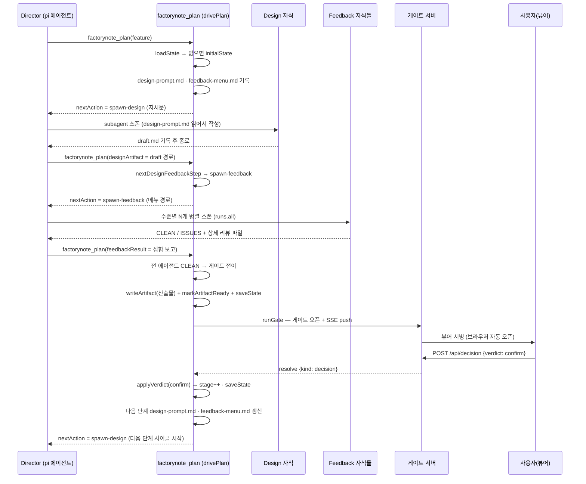

- `drivePlan` 은 **1스텝만** 구동하고 지시문을 반환 — 스폰 실행은 Director 의 몫(pi 는 확장 코드에서 동기 스폰 불가, ADR-009).
- 산출물·지시문 교환은 전부 **파일 프로토콜**(ADR-010): Director 컨텍스트에 본문이 쌓이지 않는다.
- Feedback 판정 취합: `CLEAN` 이 전 에이전트면 게이트 직행, 하나라도 `ISSUES` 면 수정 사이클(시나리오 12).
- 뷰어 갱신은 폴링 없이 **SSE push**(ADR-022) — `notifyViewerState` 가 산출물 기록 시점에 발송.

### 2. 수정 지시 (modify)

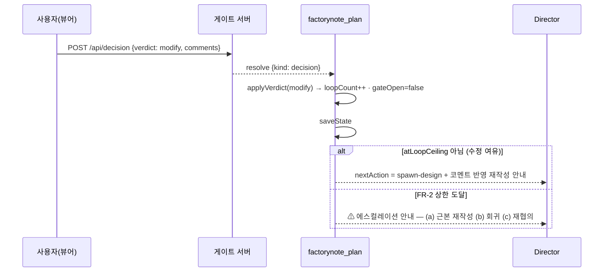

- 코멘트는 `formatComments` 로 메시지 본문에 인용 블록 포함 — Design 자식 재작성 시 입력.
- `MAX_LOOPS` 초과 수정 시도는 **경성 에스컬레이션**(FR-2): 무한 수정 루프 차단.

### 3. 정정 (revert · revertTo 다단계 점프)

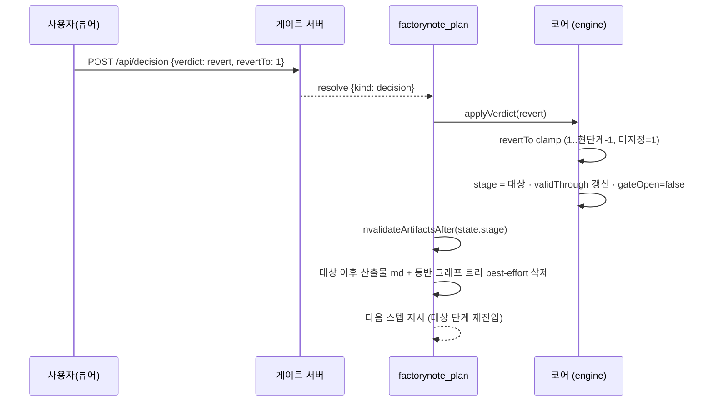

- 회귀는 **다단계 점프**(FR-7): 뷰어 셀렉터가 `revertTo` 전송 → 게이트 서버가 forward(과거 drop P0 수정됨) → 엔진 clamp.
- 무효화 대상 산출물은 `<!-- graph: ... -->` 참조를 읽어 **그래프 트리 전체**(루트 json + 자식 디렉터리)를 동반 삭제(ADR-018·020) — 이름 추론 불가라 md 를 먼저 읽는다.
- `validThrough` 갱신으로 무효화 경계가 상태에 남는다.

### 4. 파이프라인 완료

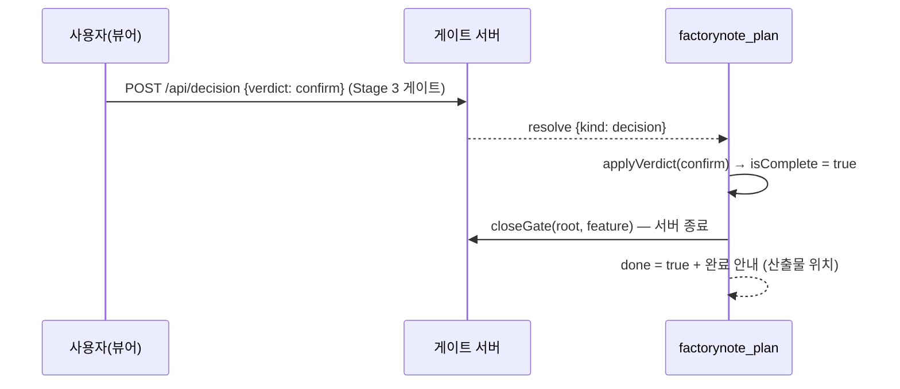

- 서버는 플랜 전체에서 **기능별 1개** 재사용되다가 완료 시에만 닫힌다 — 그 전에는 게이트 결정마다 서버 유지(같은 탭 재사용).

---

## 그룹 2 — 채팅 · 큐 · 검토 요청 루프

### 5. 게이트 채팅 문답 (chatPending 루프)

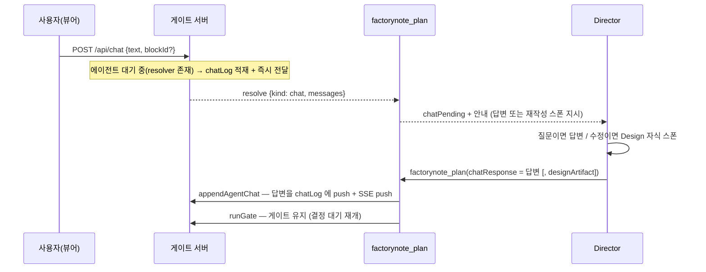

- `chatPending` 수신 후 에이전트가 턴을 종료하면 루프가 끊긴다 — 도구 반환 지시문 상단 + `promptGuidelines` 가 `factorynote_plan(chatResponse)` 재호출을 강제([[chat-loop-reentry]]).
- 블록 지정 코멘트(`blockId`)·인용(`quote`)이 메시지 메타로 운반된다.

### 6. 채팅 전송 대기 큐 (pendingChats · read-wins 취소)

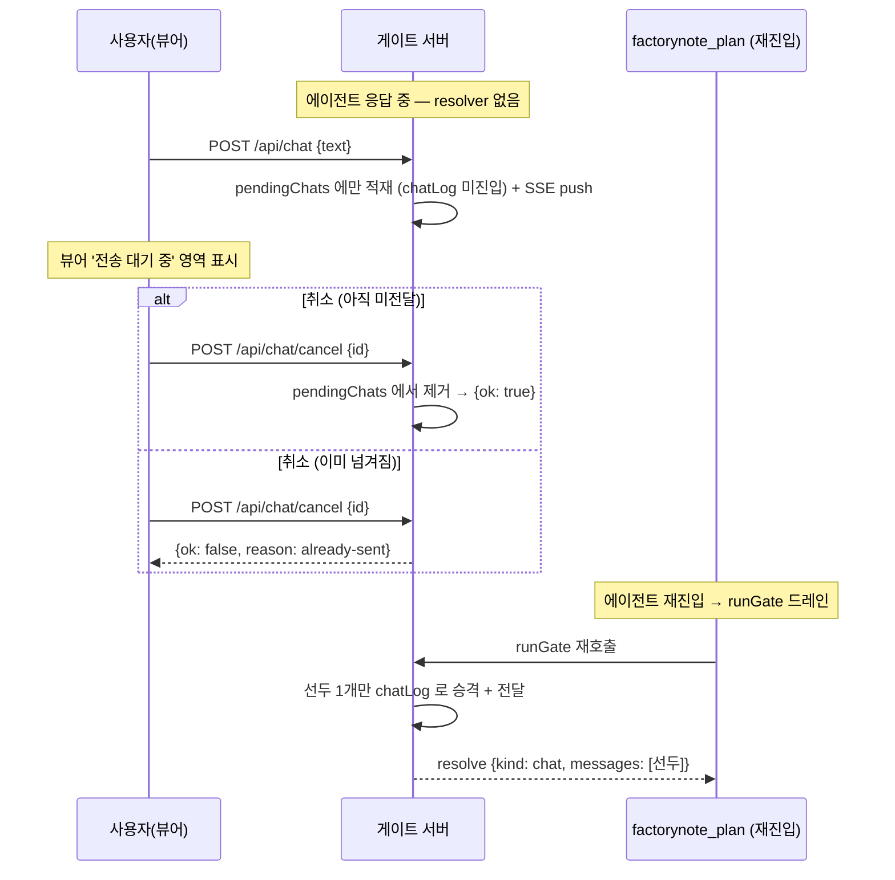

- **read-wins**: 큐에 없으면 이미 넘겨진 것 — 단일 스레드 불변조건으로 이중 삭제 불가(ADR-024).
- 드레인은 **선두 1개씩**(ADR-026): 대기 채팅 여러 개가 한 번에 배출되지 않고 각각 앞 응답 종료 후 순서 실행.

### 7. 단계 진행 요청 (stage-request 단일 채널 전이)

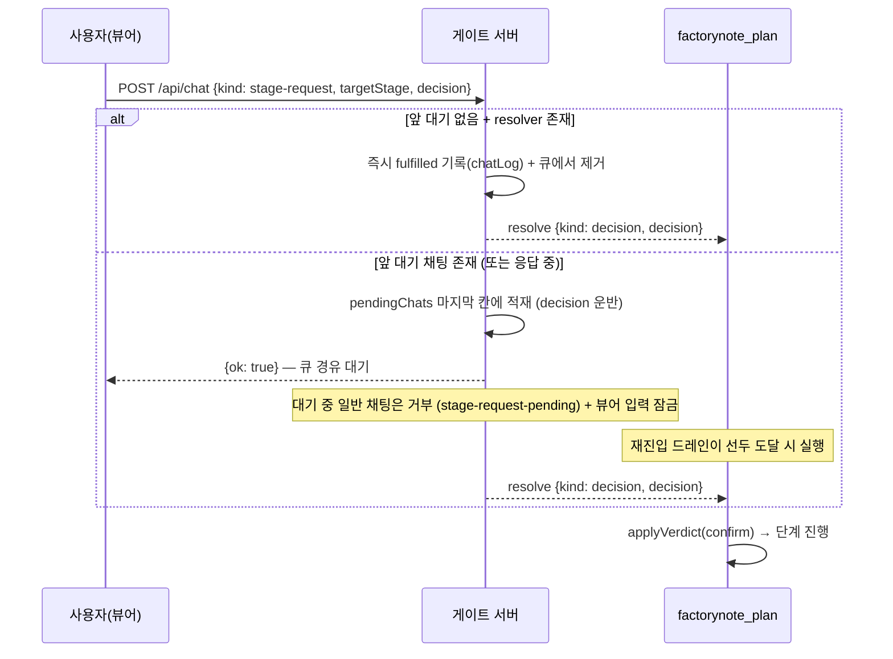

- 확정(단계 진행)은 채팅과 **같은 큐의 마지막 칸**에 `decision` 필드를 실어 적재 — 응답 중 확정이 드롭되던 버그의 구조적 제거(ADR-026).
- 기존 stage-request 가 있으면 `{ok: false, reason: already-pending}`.
- 게이트 바의 '✓ 확정' 이 이 경로를 호출 — 최종(3단계) 확정도 동일 채널.

### 8. 검토 요청 (+1 사이클)

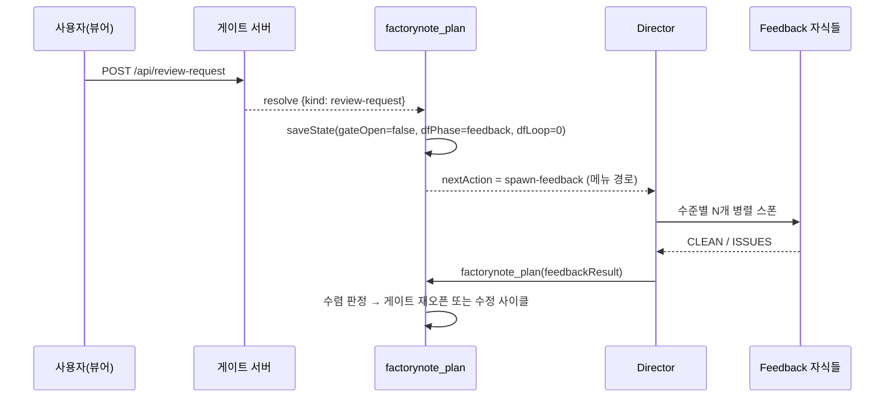

- 게이트를 닫지 않고 **+1 재검토 사이클**만 추가(ADF-013) — 내부 루프 상한과 독립적으로 사용자가 런타임에 검토를 강제하는 수단.

---

## 그룹 3 — 복구 · 예외 경로

### 9. 인터럽트 복구 (게이트 재오픈)

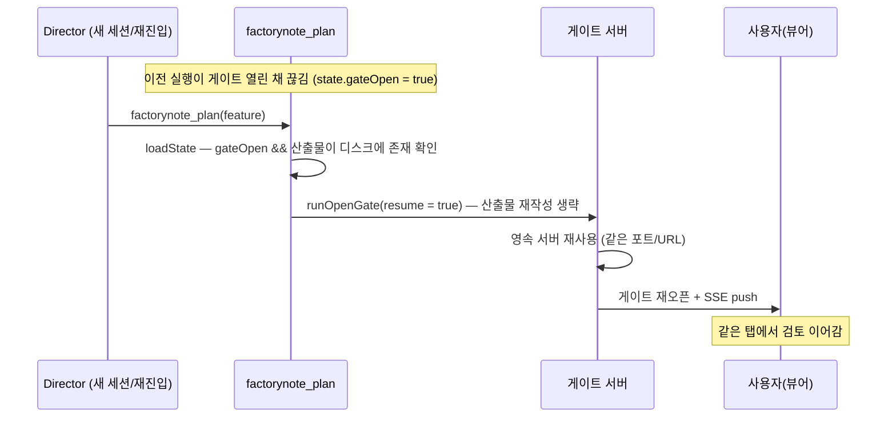

- 재진입 입력에 `designArtifact`·`feedbackResult` 가 없고 디스크 산출물이 있으면 **resume** — 산출물 재기록 없이 게이트만 다시 연다.
- 영속 서버 + 하트비트(SSE 연결 또는 최근 요청)로 탭이 살아있으면 브라우저를 재오픈하지 않는다(다중 탭 방지).

### 10. 게이트 열림 중 재작성 반영 (designArtifact 재호출)

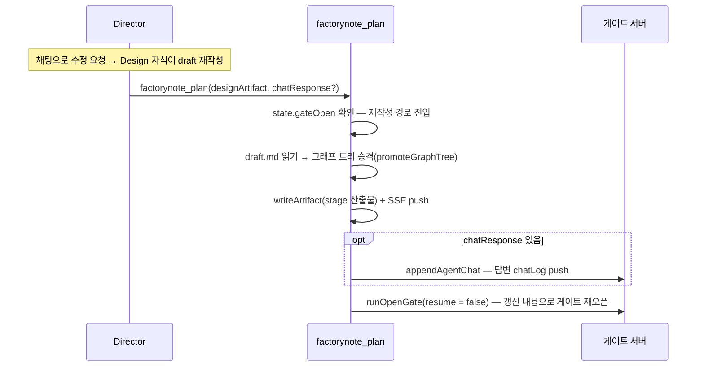

- 게이트를 닫고 새로 열지 않는다 — **게이트 유지**가 원칙(ADR-009). 이 경로가 없던 시절 폴백으로 빠져 뷰어가 멈추던 결함이 있었다([[chat-rewrite-gate-reopen]]).

### 11. Stage 2 그래프 강제 (반려 · 에스컬레이션)

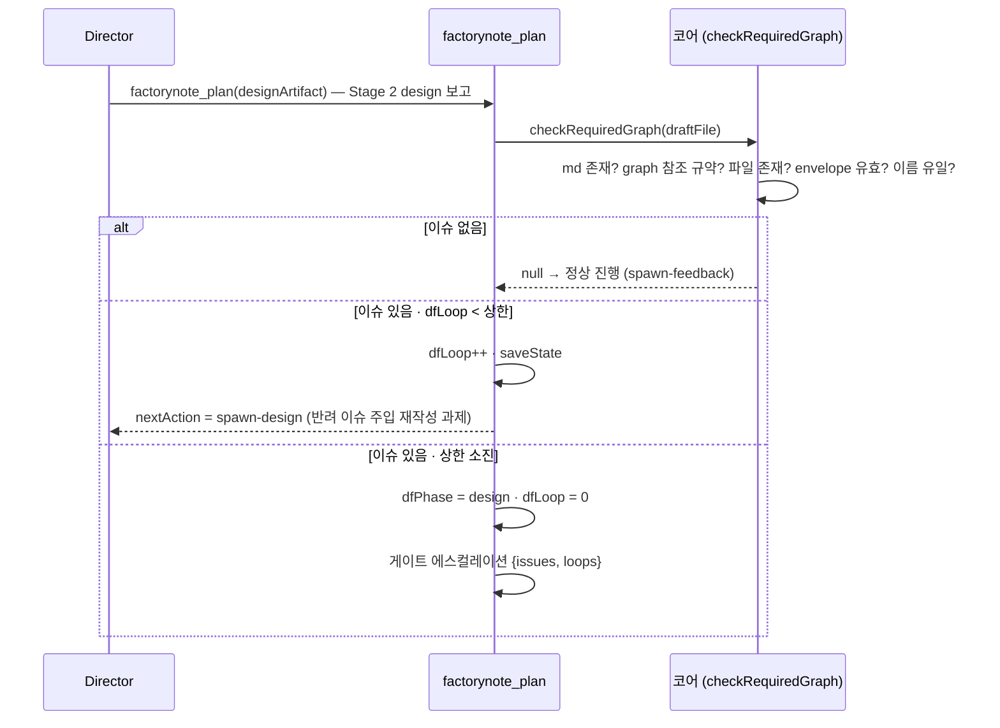

- Stage 2 는 프롬프트 요청에 그치지 않고 **코드로 강제**(ADR-019): `graph: required` 단계는 참조·파일·envelope 검증 통과 전까지 Feedback 으로 넘어가지 못한다.
- 반려 라운드에도 design-prompt·feedback-menu 가 먼저 기록되어 있어 재작성 자식이 현 단계 지시를 읽는다.

### 12. Feedback 미수렴 에스컬레이션

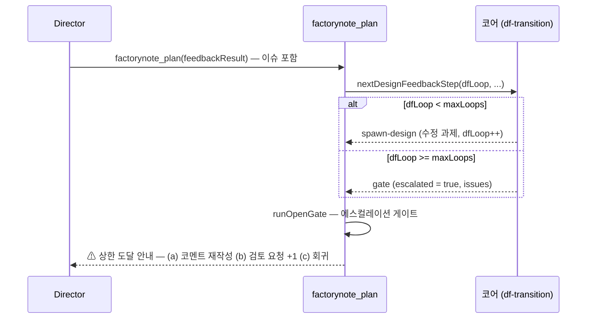

- 내부 Design↔Feedback 사이클은 `DEFAULT_MAX_LOOPS` 회 제한 — 미수렴 시 사용자 판단으로 에스컬레이션(게이트가 최종 권위, 원칙 1).

### 13. 도달 불가 안전 추락

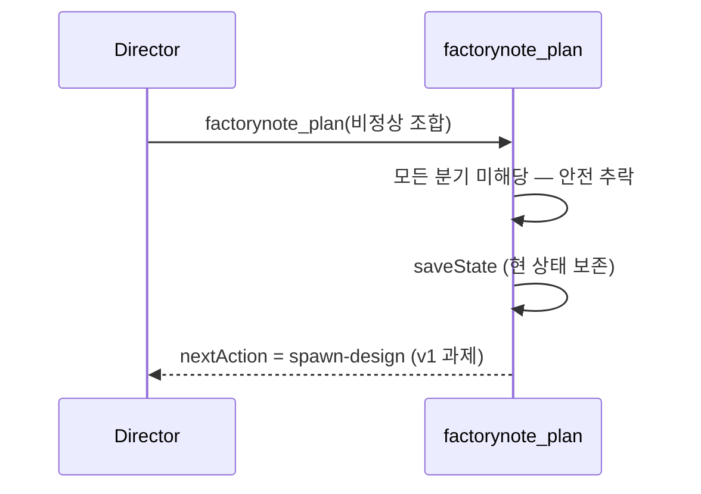

- 설계상 도달 불가(예: design 단계인데 보고가 없는 경우는 시나리오 1이 처리) — 비정상 재진입에서도 상태를 잃지 않고 Design v1 스폰으로 복귀한다.
- 동형 추락이 시나리오 9(인터럽트 복구)의 feedback 단계 버전에도 있다: 수준 `none` 이면 게이트 직행, 아니면 Feedback 재스폰 유도.

---

## 그룹 4 — 관찰 모드 · 완료

### 14. auto-advance (observeGate)

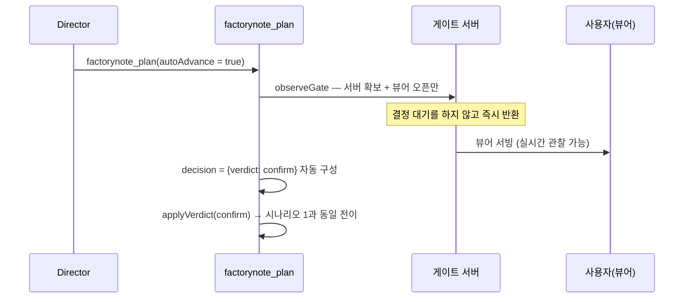

- 게이트 블로킹 없이 뷰어만 열고 확정은 자동 적용 — 스모크 검증(`scripts/repro-drive.mjs`)·무인 구동용. 대화형 사용은 `runGate`(결정 대기) 경로.

---

## 불일치 노트

작성 중 코드-문서 불일치 발견 시 기록하는 섹션.

- **없음** (2026-08-16 작성 시점 — `gate-events.ts` kind 3종, 게이트 API 6종, `nextAction` 값, 전이 표가 코드와 일치함을 확인).
